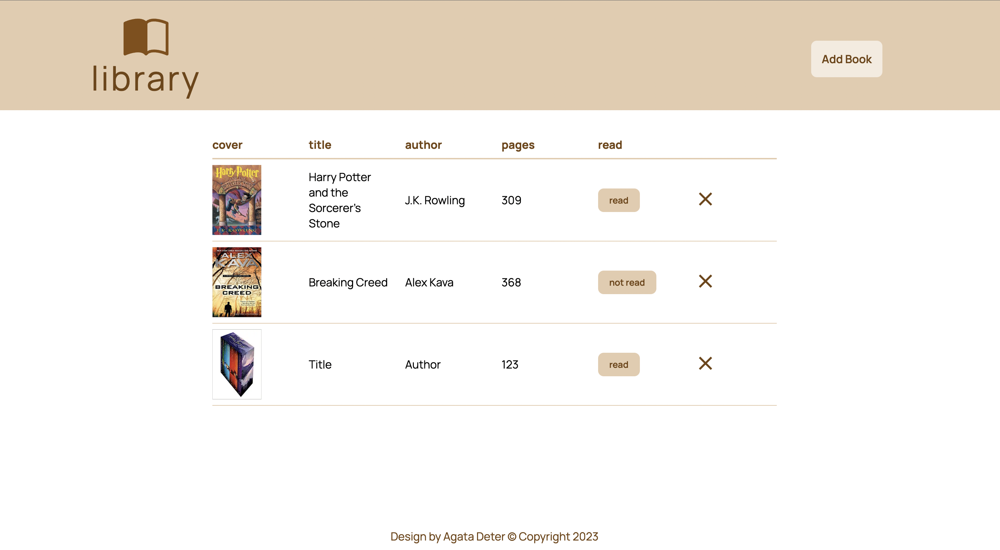

# Library

## Table of Contents
* [General Info](#general-information)
* [Technologies](#technologies)
* [Screenshots](#screenshots)
* [Link to game](#link-to-game)
* [Setup](#setup)
* [Usage](#usage)

## General information
Project is one of the task from [The Odin Project](https://www.theodinproject.com/lessons/node-path-javascript-library). It is a continuation of learning JavaScript. The main goal is to pracise creating objects.

## Technologies
* CSS3
* HTML5
* JavaScript

## Screenshots

## Link to game
https://agata10.github.io/library/

## Setup

1. Fork repository 
or
2. Clone reposiory
   `git clone https://github.com/YOUR-USERNAME/YOUR-REPOSITORY`

## Usage

Also I tried to play with responsive design for phone.

The library is simple. It shows books in table. User can press "ADD BOOK" and the small widndow pops out to add book. User can change "READ" status by clicking the button. If user doesn't add img url for cover, there will be automatically added logo of the library instead of cover.

The project let me focus on objects in JS and array of objects as also, working with DOM.
